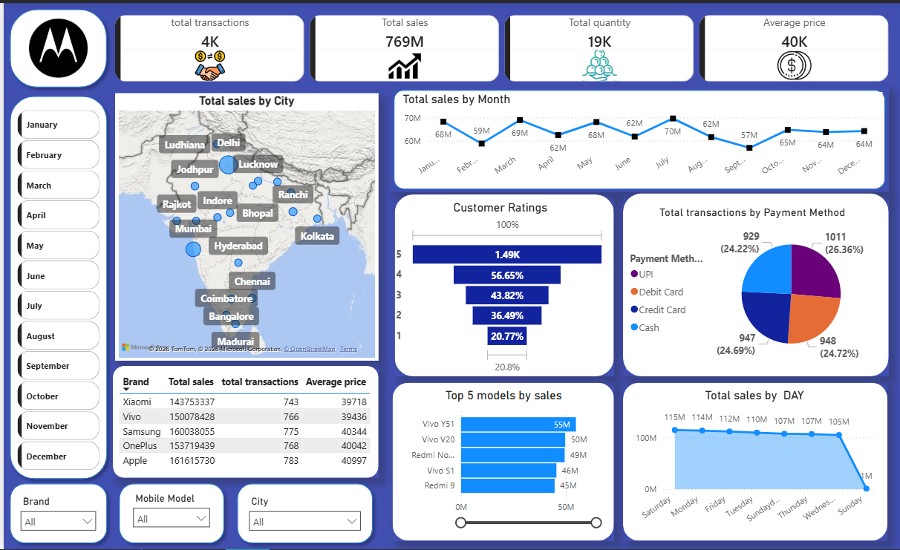

# Motorola Mobile Sales Dashboard 📊

## Overview

This project presents an interactive Power BI dashboard built to analyze Motorola mobile phone sales data. The dashboard provides insights into sales performance, customer behavior, product popularity, and payment preferences through dynamic visualizations and filters.

## Dashboard Preview



---

## Key Performance Indicators (KPIs)

| Metric | Value |
|----------|----------|
| Total Sales | 769M |
| Total Transactions | 4K |
| Total Quantity Sold | 19K |
| Average Price | 40K |

---

## Dashboard Features

### 📍 Sales by City
- Interactive map visualization
- Compare sales performance across multiple cities
- Identify high-performing markets

### 📈 Monthly Sales Trend
- Track sales performance month by month
- Detect seasonal trends and sales fluctuations

### 📊 Sales by Day
- Analyze sales distribution across days of the week
- Identify peak sales periods

### 🏷️ Brand Performance
- Compare sales across different mobile brands
- Analyze transaction volume and average selling price

### 📱 Top Selling Models
- View the top 5 mobile models based on sales revenue
- Identify best-performing products

### ⭐ Customer Ratings
- Analyze customer satisfaction levels
- Monitor rating distribution and customer feedback trends

### 💳 Payment Method Analysis
- Breakdown of transactions by:
  - UPI
  - Credit Card
  - Debit Card
  - Cash

### 🎛️ Interactive Filters
Users can dynamically filter the dashboard by:
- Month
- Brand
- Mobile Model
- City

---

## Tools & Technologies Used

- Power BI Desktop
- Microsoft Excel
- Power Query
- DAX (Data Analysis Expressions)

---

## Dataset Information

The dataset contains:

- Sales Transactions
- Mobile Brands
- Mobile Models
- Customer Ratings
- Payment Methods
- City-wise Sales Data
- Product Pricing
- Quantity Sold

---

## Business Insights

This dashboard helps answer questions such as:

- Which cities generate the highest sales?
- Which mobile models contribute most to revenue?
- How do sales vary across months?
- What are the preferred payment methods of customers?
- Which brands perform best in terms of sales and transactions?
- How satisfied are customers based on ratings?

---

## Project Files

| File Name | Description |
|------------|------------|
| motorola sales dashboard.pbix | Power BI Dashboard |
| Motorola Mobile Sales Data.xlsx | Source Dataset |
| dashboard.png | Dashboard Screenshot |

---

## How to Use

1. Download or clone this repository.

```bash
git clone https://github.com/rajrathod2048/motorola-mobile-sales-dashboard.git
```

2. Open `motorola sales dashboard.pbix` using Power BI Desktop.

3. Refresh the data if required.

4. Explore the dashboard using the available filters and visualizations.

---

## Skills Demonstrated

- Data Cleaning
- Data Transformation
- Data Modeling
- DAX Measures
- Business Intelligence
- Dashboard Design
- KPI Development
- Data Visualization

---

## Author

**Raj Rathod**

Final Year B.Tech (Information Technology)

Aspiring Data Analyst | Power BI Developer
---

⭐ If you found this project helpful, consider giving the repository a star.
